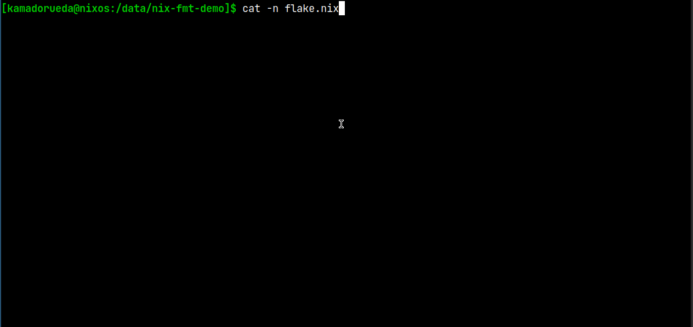

# `$ nix fmt` demo!

> Note: you need to clone the repository for the demo to work

flake.nix:

```nix
{
  outputs = { nixpkgs, self }: {
    formatter.x86_64-linux =
      nixpkgs.legacyPackages.x86_64-linux.alejandra;
  };
}
```


